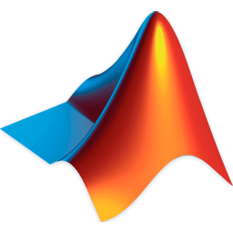

# Inspiring Continual Learning
A curated list of inspiring Continual Learning (aka Incremental Learning) resources.

## Introduction

It is a well known fact that biological brains considerably outperform current artificial neural networks when it comes to learning adaptively. Humans, as most of life forms, are, in fact, orders of magnitude more efficient than our Deep Learning (DL) models at tackling never seen problems sequentially. There is much evidence that this is due to our ability to exploit previously learned priors [[1](#ref1)] to understand the mechanics behind the new task, in order to quickly come to a solution.

This is possible because our brain is able to learn continually, acquiring knowledge while also retaining useful information about previous experience. In the context of Machine Learning (ML), this capability is generally called Continual learning (CL).

More specifically, an artificial CL agent should also exhibit the following attributes:
- **Online learning**: the model should be able to update itself using a sequential stream of data or tasks;
- **Presence of transfer**: knowledge of old task should help improve performance on new ones and vice versa;
- **Bounded system size**: the capacity of the model in terms of number of neurons and available memory should be fixed;
- **No direct access to previous experience**.

Arguably, CL is one of the ingredients that play a fundamental role in the creation of Artificial General Intelligence (AGI). Unfortunately, it just so happens that the current generation of neural networks performs very poorly in this adaptive scenario.

In fact, DL models are usually haunted by a well studied problem called **catastrophic forgetting**. Catastrophic forgetting is the tendency of neural models to severely degrade performance on previous tasks when training on new tasks. This is particularly difficult to solve because it is intrinsic to the optmization methods (e.g. gradient descent) used to learn the weights of the networks.

From a Bayesian perspective, avoiding catastrophic forgetting seems straightforward. It is sufficient to retain a distribution over model parameters that indicates the plausibility of any setting given the observed data and then, when new data arrive, combine it with the new information, preventing parameters that strongly influence prediction from changing drastically [[2](#ref2),[3](#ref3)]. The problem with this approach is that Bayesian inference is usually intractable.

Following the idea of restraining drastic changes of the model, some studies introduced regularization terms depending on some Bayesian inference approximations, for instance:  Fisher information [[4](#ewc)], path integral [[5](#ref5)], variational approximation [[3](#ref3)]. To push this concept even further, a few Meta Continual Learning approaches propose to train another neural network to predict parameter update steps instead of trying to formulate a hand-crafted constraint function [[6](#ref6)].

Other works, instead, make use of extra-memory or generative models that provide a replay of data for past tasks. The result is a cooperative dual model architecture consisting of a *generator* and a *solver* [[7](#ref7)]. Since the *generator* maximizes the likelihood of generated samples being in the real distribution of data for the previous task, it can be used to feed new data to the *solver*.

[1] [Investigating Human Priors for Playing Video Games](https://arxiv.org/pdf/1802.10217.pdf), ICML 2018, [website](https://rach0012.github.io/humanRL_website/) 
[2] [A Unifying Bayesian View of Continual Learning](https://arxiv.org/abs/1902.06494), NIPS 2018 
[3] [Variational Continual Learning](https://arxiv.org/abs/1710.10628), ICLR 2018 
[4] [Overcoming catastrophic forgetting in neural networks](https://arxiv.org/abs/1612.00796), PNAS 
[5] [Continual Learning Through Synaptic Intelligence](https://arxiv.org/abs/1703.04200), ICML 2017 
[6] [Meta Continual Learning](https://arxiv.org/abs/1806.06928), Arxiv  
[7] [Continual learning with deep generative replay](https://arxiv.org/abs/1705.08690), NIPS 2017

## Datasets
| Name | Resolution | Classes | Images | Size |
|:-:|:-:|:-:|:-:|:-:|
| [MNIST][web:mnist] | 28x28 | 10 (permuted / disjoint) | 70K | 20 MB |
| [CIFAR][web:cifar] | 32x32 | 10 / 100 | 60K | 160 MB |
| [ImageNet][web:imagenet] | variable | 1000 | 1.2M | 154 GB |
| [CUB][web:cub] | variable | 200 | 12K | 1.1 GB |

[web:mnist]: http://yann.lecun.com/exdb/mnist/
[web:cifar]: https://www.cs.toronto.edu/~kriz/cifar.html
[web:imagenet]: http://www.image-net.org/download-images
[web:cub]: http://www.vision.caltech.edu/visipedia/CUB-200-2011.html

\* on average, though images are usually downscaled to 256x256

## Template
Each entry should be formatted as below:

---

[Title of the Paper][paper:paper_id], Conference  
*Authors* 

| Category | Datasets | Code | Inspiration Score |
|:-:|:-:|:-:|:-:|
| regularization   sample   generative   meta | list of datasets | [][code:paper_id] pytorch   [][code:paper_id] tensorflow   :no_entry_sign: no code | :thinking: not sure   :star: good   :fire: super |

**Summary:** 
three to five lines summary.

**Comment:** 
three to five lines comment.

[paper:paper_id]: https://arxiv.org
[code:paper_id]: https://github.com

---
<!--- an example, copy paste from here

---

[Name of the Paper][paper:paper_id], conference  
*Authors* 

| Category | Datasets | Code | Inspiration Score |
|:-:|:-:|:-:|:-:|
| regularization | [disjoint-MNIST](#disjoint-mnist)  |  | :star: |

**Summary:** 
three to five lines summary goes here.

**Comment:** 
three to five lines comment goes here.

[paper:paper_id]: https://arxiv.org
[code:paper_id]: https://github.com

---

-->

## Papers

Papers are organized in chronological order. If the same method has been published in different conferences / journals, all of them need to be listed both in the list index and the detailed list. The summary and table should refer to the most recent publication (usually journal). When many implementations are available, just include the ones that look more user frendly. In the case there are too many authors for one publication just report the first three + *et al.*

### List

- [Learning without Forgetting](#lwf), ECCV 2016 / PAMI 2017
- [Overcoming catastrophic forgetting in neural networks](#ewc), PNAS 2017
- [Continual learning through synaptic intelligence](#si), ICML 2017
- [Encoder Based Lifelong Learning](#ebll), ICCV 2017
- [Overcoming Catastrophic Forgetting by Incremental Moment Matching](#imm), NIPS 2017
- [Gradient Episodic Memory for Continual Learning](#gem), NIPS 2017

---

[Learning without Forgetting](https://arxiv.org/abs/1606.09282), ECCV 2016 / PAMI 2017 
*Zhizhong Li, Derek Hoiem*

| Category | Datasets | Code | Inspiration Score |
|:-:|:-:|:-:|:-:|
| regularization | MNIST, CIFAR, ImageNet, CUB |   | :star: |

**Summary:** 
LwF proposes to preserve the performance on the old task using [knowledge distillation](https://arxiv.org/abs/1503.02531). They introduce a regularization term (distillation loss) in training that encourages the outputs of the new network to approximate the outputs of the old network. Several regularization losses (L1, L2, cross-entropy) are tested with similar results to distillation loss. Both single and multiple new tasks are explored. The experiments show that LwF moderately outperforms feature extraction, finetuning, [Less-forgetting Learning](#lfl), while compared to the joint training setup, it tends to underperform on the old task (as expected).

**Comment:** 
The main disadvantage of LwF is that it seems to work only in the case that the two tasks (new and old) are very similar. This is because the features extracted by the old network on the new task might might not be representative, since the network has been trained on very different data. Also, this approach is expensive as it requires computing a forward pass through the old task’s network for every new data point.

---

[Overcoming catastrophic forgetting in neural networks](https://arxiv.org/abs/1612.00796), PNAS 2017 
*James Kirkpatrick, Razvan Pascanu, Neil Rabinowitz, et al.*

| Category | Datasets | Code | Inspiration Score |
|:-:|:-:|:-:|:-:|
| regularization | MNIST |   | :fire: |

**Summary:** 
This paper by DeepMind introduces Elastic Weight Consolidation (EWC), a method that slows down learning on certain weights based on how important they are to previously seen tasks. Ideally the importance of each weight should be estimated using the posterior distribution of the weights given task A: *p(θ|DA)*. The true posterior probability is intractable, so they approximate
the posterior as a Gaussian distribution with mean given by the parameters θ*A and a diagonal precision given by the diagonal of the Fisher information matrix (*F*). Using *F* is convenient because it approximates the second derivative of the loss near the minimum but it can be computed easily from the first derivative. EWC is evaluated on both supervised and reinforcement learning scenarios. For supervised learning they use permuted MNIST with very good results.

**Comment:** 
The method is interesting and well theoretically grounded. The problem with the paper, from a Computer Vision point of view, are the experiments: permuted MNIST is not a good benchmark. Also, the importance (Fisher information) of the weights needs to be computed in a separate phase, using a sample of data points for each task.

---

[Continual learning through synaptic intelligence](https://arxiv.org/abs/1703.04200), ICML 2017 
*Friedemann Zenke, Ben Poole, Surya Ganguli*

| Category | Datasets | Code | Inspiration Score |
|:-:|:-:|:-:|:-:|
| regularization | MNIST, CIFAR |  | :star: |

**Summary:** 
Synaptic Intelligence (SI) method is introduced, which is similar to [EWC](#ewc), but computes the importance of each weight in an online fashion, along the entire learning trajectory. SI introduces a regularization loss that is composed by: (i) a factor that estimates how much an individual parameter contributed to the drop in the loss by computing the path integral of the gradient vector field along the parameter trajectory (approximated with *gradient x parameter update*); and (ii) the squared distance of each parameter from its previous value, that quantifies how far it moved from the previous task configuration. SI is tested on disjoint and permuted MNIST and CIFAR 10/100. Results are comparable to [EWC](#ewc).

**Comment:** 
It is very interesting that just using the gradient (squared) as a weight is enough to prevent the network from forgetting old tasks. Also, the fact that the weights are computed online during training is very convenient. However, it would have been nice to have more experiments to assess the difference in performance with [EWC](#ewc)

---

[Encoder Based Lifelong Learning](https://arxiv.org/abs/1704.01920), ICCV 2017 
*Amal Rannen Triki, Rahaf Aljundi, Mathew B. Blaschko, Tinne Tuytelaars*

| Category | Datasets | Code | Inspiration Score |
|:-:|:-:|:-:|:-:|
| regularization | ImageNet, CUB, ... |  | :star: |

**Summary:** 
Similar to [LwF](#lwf) but it introduces an autoencoder that takes as input the features extracted by the first part of the *solver* network and tries to reconstruct them. During training the encoded representation (bottleneck of the autoencoder) is used to prevent the network from changing drastically, by means of a *code loss*. The dimension of the bottleneck is smaller than the dimension of the input, so the autoencoder captures the submanifold that represents the best the structure of the input data. Distillation loss and classification loss are also used in training. Experiments are conducted on sequences of 2/3 tasks. Results show a tiny increment in performance wrt [LwF](#lwf).

**Comment:** 
The idea is somehow nice and the experiments are fine but the improvement in performance IMHO is not enought to justify the use of an additional autoencoder.

---

[Overcoming Catastrophic Forgetting by Incremental Moment Matching](https://arxiv.org/abs/1704.01920), NIPS 2017 
*Sang-Woo Lee, Jin-Hwa Kim, Jaehyun Jun, Jung-Woo Ha, Byoung-Tak Zhang*

| Category | Datasets | Code | Inspiration Score |
|:-:|:-:|:-:|:-:|
| regularization | MINST, CIFAR, ImageNet, CUB |  | :star: |

**Summary:** 
IMM uses a Gaussian distribution to approximate the posterior distribution of parameters for each task, and then tries to find the optimal parameter configuration for all tasks using the mean (mean-IMM) or the mode (mode-IMM) of the posteriors. For the mean-IMM algorithm they just take the average of the posteriors, while for mode-IMM they also take into account the variance (approximated by the diagonal of the Fisher information matrix, as per [EWC](#ewc)) in order to find the maximum of the mixture of Gaussian posteriors. To make IMM reasonable, the search space of the loss function between the posteriors should be reasonably convex-like. To smooth the loss they use 3 techniques: weight-transfer, L2-transfer and drop-transfer. In particular, the novelty here is the introduction of drop-transfer, a regularizer similar to dropout but instead of turning off the neurons it just uses the value for the previous task. 

**Comment:** 
This paper is interesting for two reasons: (i) they merge the networks generated from different tasks after training, (ii) they introduce drop-transfer to smooth the loss function and avoid high cost barriers inbetween the configurations they want to merge. By the way, the functioning of drop-transfer reminded me of [Zoneout](https://arxiv.org/abs/1606.01305) (although Zoneout remembers activations while drop-transfer remembers parameters).

---

[Gradient Episodic Memory for Continual Learning](https://arxiv.org/abs/1704.01920), NIPS 2017 
*David Lopez-Paz, Marc'Aurelio Ranzato*

| Category | Datasets | Code | Inspiration Score |
|:-:|:-:|:-:|:-:|
| sample | MINST, CIFAR |  | :fire: |

**Summary:** 
This work approaches CL in a sligtly different way with respect to most other studies. At training time they add the constraint that each example can be seen only once by the solver. Also, tasks come in sequences without any constraint on the order, and the solver is aware of the task it is tackling at each time. With said CL framework, the paper introduces Gradient Episodic Memory (GEM) whose main feature is an episodic memory (small set of samples) of the learned tasks. Instead of being used to keep the predictions at past tasks invariant by means of distillation as in [iCaRL](#icarl), this episodic memory is employed as an inequality constraint to avoid the increase in the loss but allowing its decrease, therefore enabling positive backward transfer. This can be done without storing old parameters, since the increase in the loss for previous tasks can be diagnosed by computing the angle between the loss gradient vector of the old samples and the proposed update. In case the cosines of the angles to previous task gradients are all positive, then the update is carried out, otherwise the update (gradient) is projected to the closest gradient that does not increase the loss on any (all) tasks. In practice they use first order Taylor series approximation to estimate the update direction ([A-GEM](#agem) will further relax the constraint on projection). Experiments are very strong and, interestingly, they also show evaluate 

**Comment:** 
The concept introduced in this paper is very cool: they constrain the update of the new task to not interfere with the previous tasks, and this is achieved through projecting the estimated gradient direction on the feasible region outlined by previous tasks’ gradients. It also seems to work reasonably well in practice, although it can be a bit slow in training.

---
